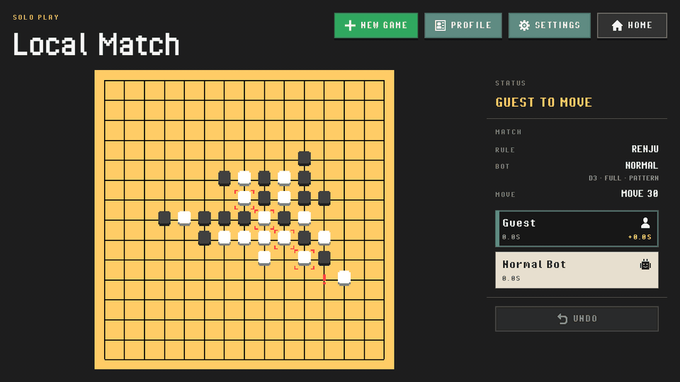
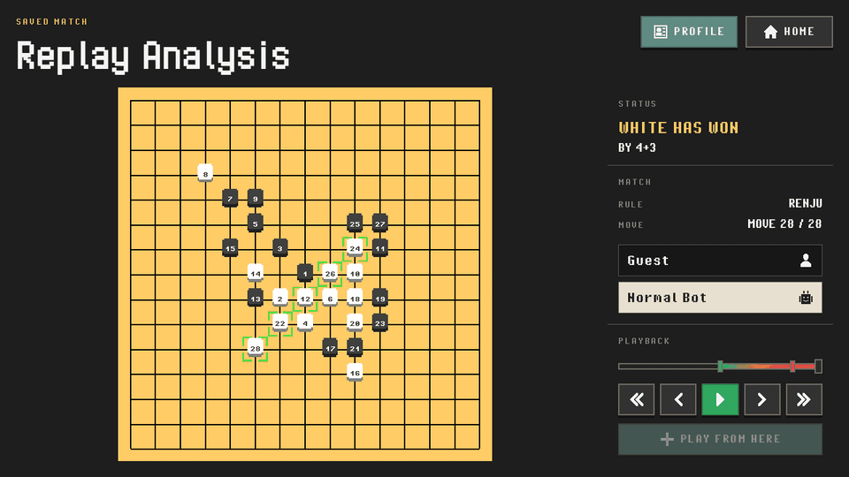
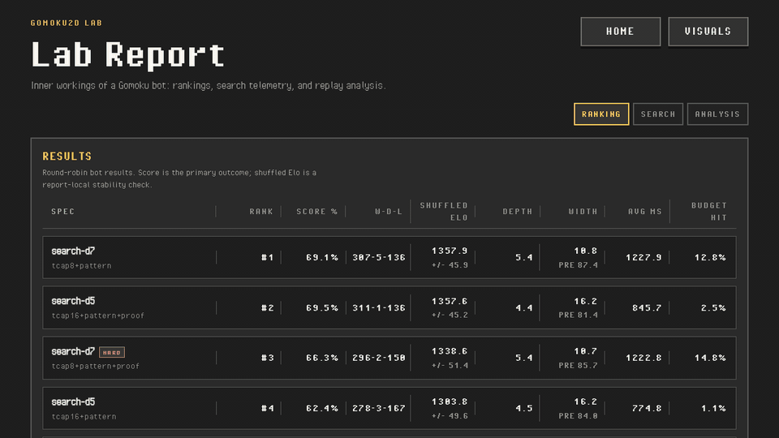
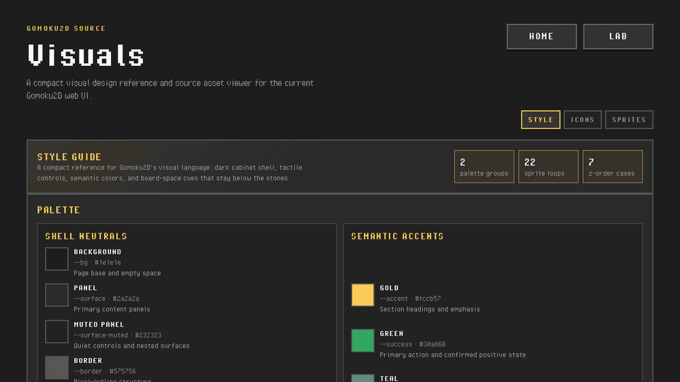

# Gomoku2D

*An old favorite, built properly.*

Gomoku2D is a local-first browser Gomoku/Renju game with a retro board, a
Rust/WebAssembly rules core, configurable bots, and replay analysis that walks
backward through a finished game to show where it turned.

It is also a production experiment: one developer, an agent-assisted workflow,
and a serious question behind a small game. How much of a real product team's
surface area can agents help cover while the human still owns taste, scope, and
technical judgment?

**Live site:** https://gomoku2d.byebyebryan.com/



## Highlights

- **A personal game, built like a product.** Gomoku was a paper-and-pencil
  childhood favorite and one of my first game-dev targets. This version keeps
  that thread, but treats the project like a real product rather than a
  nostalgia sketch.
- **A simple game with a visible mind.** The goal is not to ship the strongest
  possible Gomoku engine. The more interesting target is a game that can expose
  what it understands: threats, combos, forced corridors, failed escapes, and
  why a replay was lost.



- **A lab under the board.** The Rust bot lab produces the browser bot, the
  Replay Analysis model, the published Lab report, and the vocabulary the app
  uses to explain strategy.



- **A visible visual system.** Pixel sprites, icons, fonts, source sheets, and
  design tokens are published as a Visuals guide instead of hidden as incidental
  assets.



- **An agent-assisted production experiment.** Agents expanded what one
  developer could attempt across implementation, analysis, review, docs,
  reports, and release chores. Taste, scope, and technical judgment still
  remained human responsibilities.

## Features

- Play immediately against Easy / Normal / Hard bots with no account required.
- Choose Freestyle or Renju, including Renju forbidden-move feedback.
- Tune bot depth/width/scoring/proof options from Settings.
- Enable tactical hints for immediate threats, imminent threats, counter
  threats, and evidence stones.
- Use desktop or portrait mobile layouts with dedicated touch controls.
- Save local guest history in the browser, or sign in with Google for private
  cloud-backed history across browsers.
- Inspect finished games in Replay Analysis, step backward by turns, see the
  lethal onset / setup corridor / last escape, and branch from a replay position
  into a fresh practice game.
- Open the Lab report to inspect bot rankings, search telemetry, and replay
  analysis examples generated by the Rust harness.

## Repository Map

```text
gomoku2d/
├── gomoku-web/         browser app: React shell, Phaser board, wasm bridge
├── gomoku-bot-lab/     Rust lab: rules, bots, analyzer, eval, CLI, wasm
├── reports/lab/        curated JSON artifacts rendered by /lab/
├── docs/               reference docs, working notes, and archives
└── scripts/            release and process-story helpers
```

The browser game lives in [`gomoku-web/`](gomoku-web/). The Rust side lives in
[`gomoku-bot-lab/`](gomoku-bot-lab/). Player-facing explanations are published
in the app; technical references start at [`docs/README.md`](docs/README.md).

## Explore The Project

- [`gomoku-web/README.md`](gomoku-web/README.md): web app architecture, local
  development, build, and deploy notes.
- [`gomoku-bot-lab/README.md`](gomoku-bot-lab/README.md): Rust workspace,
  native commands, eval harness, and wasm bridge.
- [`docs/README.md`](docs/README.md): current product, architecture, lab, and
  operations references.
- [`docs/reference/product/roadmap.md`](docs/reference/product/roadmap.md):
  current sequencing.
- [`CHANGELOG.md`](CHANGELOG.md): release history and intent.
