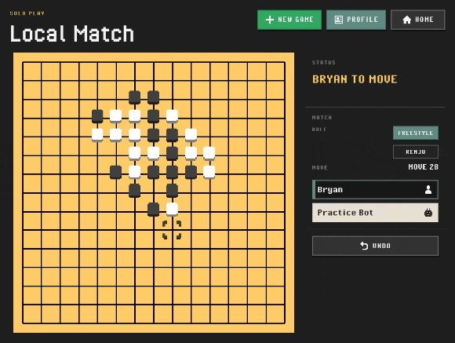

# Gomoku2D

*An old favorite, built properly.*

Gomoku2D is a simple, fun web Gomoku with a retro feel and serious engineering
underneath: a modern frontend, a Rust/WebAssembly rules core, and a Rust bot lab
for game logic and AI experiments.

It is also a production experiment: one developer, an AI-centric workflow, and
a question more interesting than raw speed: how much of a real product team's
surface area can agents help cover without lowering the quality bar?

[](https://gomoku2d.byebyebryan.com/)

**Play in browser:** https://gomoku2d.byebyebryan.com/

**Pixel-art previews:** https://gomoku2d.byebyebryan.com/assets/

**Bot lab report:** https://gomoku2d.byebyebryan.com/bot-report/

**Replay analysis report:** https://gomoku2d.byebyebryan.com/analysis-report/

The answer so far is not "type less code and ship anything." It is closer to
running a tiny product team through agents: implementation, review, test
coverage, infrastructure, asset iteration, release notes, and design critique
all stay in the loop.

## What makes it different

- **Personal, but not casual.** Gomoku was a paper-and-pencil childhood
  favorite and one of my first game-dev targets. This version keeps that
  sentimental thread, but treats it like a real alpha product instead of a
  nostalgic weekend sketch.
- **Small surface, serious foundation.** React owns the app shell, Phaser
  renders the board, and Rust rules/bot logic ship to the browser through
  WebAssembly. The split keeps the UI light without trapping core game logic in
  the frontend.
- **A lab under the board.** The Rust workspace is where rules, bots,
  benchmarks, replay formats, and future analysis/puzzle features can be built
  natively before they reach the browser.
- **AI as production leverage.** The experiment is not whether agents can
  generate code quickly. It is whether one person can use agents to cover more
  of the product loop while still preserving taste, scope control, and review
  discipline.
- **Retro assets with a real workflow.** Sprites, icons, and fonts have source
  assets, manifests, and live preview pages, so the pixel-art style can be
  iterated deliberately instead of treated as decoration.

## What works today

- Start a practice match immediately, no account required.
- Play Freestyle or Renju against the Practice Bot, with Renju forbidden-move
  feedback and mobile-friendly placement controls.
- Review local replays, scrub the timeline, and branch from a replay position
  into a fresh practice game.
- Keep guest-local history by default, or sign in with Google for private
  cloud-backed history across browsers.
- Use the same board-first app on desktop and portrait mobile.

Lives in [`gomoku-web/`](gomoku-web/) — see its README for stack, local
development, and deploy/runtime details.

---

## The Bot Lab

[`gomoku-bot-lab/`](gomoku-bot-lab/) is the other half of the project: a Rust
workspace where the game can grow beyond "browser board plus bot." Rules,
replay format, and bot behavior live here first, can be tested and benchmarked
natively, and then ship to the web game through WebAssembly.

```
gomoku2d/
├── gomoku-web/         ← the game (React + Phaser board + TypeScript)
├── gomoku-bot-lab/     ← the Rust side
│   ├── gomoku-core/      rules + board
│   ├── gomoku-bot/       Bot trait + implementations
│   ├── gomoku-eval/      self-play arena, tournaments, Elo
│   ├── gomoku-cli/       native match runner
│   └── gomoku-wasm/      wasm-pack bridge the game imports
└── docs/
```

| Crate | What it does |
|-------|--------------|
| `gomoku-core` | Board state, rules (Freestyle + Renju), win detection, FEN, replay JSON |
| `gomoku-bot` | `Bot` trait + implementations: `RandomBot`, `SearchBot` (negamax + α-β + iterative deepening + transposition table) |
| `gomoku-cli` | Run one match: pick the bots, print the board, optionally save a replay |
| `gomoku-eval` | Run many matches: self-play arena, round-robin tournaments, Elo ratings |
| `gomoku-wasm` | `wasm-pack` bridge — exports the core + bots to the web game |

Build, CLI usage, replay format, and `SearchBot` notes live in
[`gomoku-bot-lab/README.md`](gomoku-bot-lab/README.md) and
[`docs/search_bot.md`](docs/search_bot.md).

---

## Current Status

The local-first `v0.2.x` product pass made the game feel complete without
cloud: board-first play, desktop/mobile layout, replay, profile, and local
history. The `v0.3` backend-continuity line added optional Google sign-in,
Firebase/Firestore plumbing, local-to-cloud profile promotion, private
cloud-backed history, schema/rules hardening, and Reset Profile without putting
sign-in in front of the game.

The next product identity push is the lab-powered line: replay analysis,
puzzles, bot personalities, and game-review features that make the Rust lab
visible to players. For the longer-term sequencing, see
[`docs/roadmap.md`](docs/roadmap.md).

---

## Learn More

The canonical design, architecture, and release docs live in `docs/`:

- [`docs/project.md`](docs/project.md) — the product/production thesis and project tenets
- [`docs/product.md`](docs/product.md) — what we're building and why
- [`docs/architecture.md`](docs/architecture.md) — FE stack, DOM/Phaser boundary, core-sharing story
- [`docs/app_design.md`](docs/app_design.md) — current local-first routes, flows, and screen contracts
- [`docs/ui_design.md`](docs/ui_design.md) — DOM shell visual language and styling rules
- [`docs/game_visual.md`](docs/game_visual.md) — Phaser canvas, sprite, warning, and animation language
- [`gomoku-web/assets/README.md`](gomoku-web/assets/README.md) — source asset folders and local preview pages
- [Live asset previews](https://gomoku2d.byebyebryan.com/assets/) — published sprite, icon, and font previews
- [Bot lab report](https://gomoku2d.byebyebryan.com/bot-report/) — published bot-lab tournament report target
- [Replay analysis report](https://gomoku2d.byebyebryan.com/analysis-report/) — published forced-corridor analysis for the bot report's top matchup
- [`docs/ui_screenshot_review.md`](docs/ui_screenshot_review.md) — screenshot history and UI critique
- [`docs/backend.md`](docs/backend.md) — Firebase + Firestore + Cloud Run model for cloud, lab-powered, and online phases
- [`docs/backend_infra.md`](docs/backend_infra.md) — live Firebase/GCP setup, rules deployment, and env checklist
- [`docs/backend_cost.md`](docs/backend_cost.md) — backend free-tier assumptions, estimates, and headroom tracking
- [`docs/roadmap.md`](docs/roadmap.md) — version-based phase plan from POC to cloud, lab-powered identity, skins, and online features
- [`docs/release.md`](docs/release.md) — local preview, release checks, tagging, and publish workflow
- [`docs/search_bot.md`](docs/search_bot.md) — configurable `SearchBot` strategy, pipeline, and experiment takeaways
- [`docs/tactical_shapes.md`](docs/tactical_shapes.md) — canonical bot shape vocabulary for tactical facts and eval work
- [`docs/tactical_scenarios.md`](docs/tactical_scenarios.md) — focused bot tactical cases with board prints and expected moves
- [`gomoku-web/README.md`](gomoku-web/README.md) — web game stack, local dev, deploy/runtime details
- [`gomoku-bot-lab/README.md`](gomoku-bot-lab/README.md) — bot-lab build/test, CLI usage, replay format, bot notes

Superseded exploratory docs and mock briefs are preserved under
[`docs/archive/`](docs/archive/).
