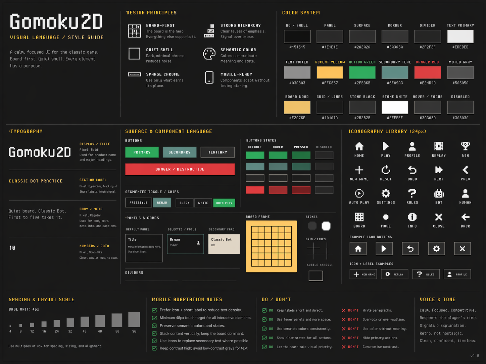

# Visual Design

Scope: the **DOM shell only**. This guide defines the styling language for the
React/UI shell around the board.

It does **not** define the Phaser board art pipeline, sprite palettes, stone
effects, or board-theme asset rules. Those can evolve independently. The shell
should stay compatible with multiple retro pixel-art board themes, not lock the
project into one exact sprite pack.

Paired with `design.md`, which defines screen roles and player-facing flows.
Comparative screenshot review lives in `visual_review.md`.

## Reference image

Current visual reference sheet:

Use this as a tone and component-language reference, not a locked screen spec.
The important takeaways are panel contrast, button weight, spacing, typography,
and accent roles. Individual layouts can still evolve. Alternative explorations
should stay in `docs/archive/` unless they become the new canonical reference.

## Reference set

For the comparative screenshot set and critique, see
[visual_review.md](visual_review.md). That document embeds the active `v0.1`,
`v0.2.1`, `v0.2.2`, and `v0.2.3` reference captures and records what each
revision got right and wrong.

The rule of thumb:

- `v0_1_*` is tone and retro feel
- `v0_2_1_*` is the first practical DOM-shell baseline
- `v0_2_2_*` is the flatter-shell baseline before the mobile-specific pass
- `v0_2_3_*` is the current paired desktop/mobile baseline

The current refinement direction is:

- keep `v0.2.2` shell tone, spacing, and button-role clarity
- keep `v0.2.3`'s screen-specific portrait layouts and compact top-bar pattern
- keep the later icon work narrow and functional
- keep tightening dense secondary surfaces like profile instead of re-expanding
  the shell

The current release assumption is:

- `v0.2.3` establishes the current UI baseline
- `v0.2.4` may carry one last small polish pass
- that follow-up should be hierarchy/spacing/consistency work, not a structural
  layout redo

## Design takeaway

- keep v0.1's retro punch and board-first confidence
- keep v0.2.1's structure, separation, and scalability
- keep v0.2.2's flatter shell and clearer button-role language
- keep v0.2.3's intentional mobile layouts and tighter transport language
- avoid reintroducing v0.1's scene-bound UI
- avoid rebuilding dense sidebars or over-explained controls as the shell grows

## Goal

Create a stable visual language for Gomoku2D that:

- feels retro, tactile, and game-like
- keeps the board as the focal point
- scales cleanly as the DOM shell grows
- remains coherent even if the board theme changes later

## Creative direction

Gomoku2D should feel like:

- a minimalist retro board game
- a dark arcade or PC-game shell
- chunky and tactile, not sleek
- sparse and intentional, not dashboard-like
- quiet around the edges, high-contrast where it matters

Keywords:

- retro
- tactile
- restrained
- pixel
- quiet
- board-centric

Avoid:

- SaaS/dashboard vibes
- admin/settings-app vibes
- nested card stacks everywhere
- soft modern shadows and rounded UI by default
- verbose product copy

## Visual identity pillars

### 1. Board is sacred

On match and replay screens, the board is the dominant visual element.

### 2. Fewer boxes

Prefer spacing, alignment, and dividers over repeated nested cards.

### 3. Chunky controls

Buttons and toggles should feel physical and game-like.

### 4. Sparse chrome

The shell should feel intentionally under-filled, not maximally occupied.

### 5. Strong semantic colors

Accent colors should have narrow, consistent jobs.

### 6. Stable shell, flexible board themes

The DOM shell should stay fixed enough to survive board-theme experiments.

- the shell should not depend on a specific stone color or board-edge asset
- shell neutrals should frame multiple retro pixel-art board themes cleanly
- if the board theme changes, the shell should still feel correct

## Future theming constraints

Theme support is a later possibility, not a current feature target.

The important constraint for now is simply: do not paint the shell into a
corner.

If themes arrive later, they should mostly live in the game layer:

- board base and frame
- grid and marks
- black and white pieces
- cursor and highlight assets
- win-line or effect visuals

The DOM shell should remain comparatively stable:

- do not redesign layout per theme
- do not rely on a board-specific palette for shell readability
- do not turn themes into full-app reskins by default

At most, the shell may pick up a small accent or compatibility hook later. The
default assumption should remain: stable shell, swappable board theme.

## Palette

The shell should use a limited palette with neutral dark surfaces and a few
high-contrast semantic accents.

Suggested current base:

- `--bg: #232323`
- `--surface: #323232`
- `--surface-muted: #2a2a2a`
- `--surface-strong: #575756`
- `--text: #f3efe5`
- `--text-muted: #a6a6a0`
- `--accent: #f9cb58`
- `--accent-deep: #a7873e`
- `--success: #2f9247`
- `--secondary: #658a90`
- `--danger: #995f3b`

These are role anchors, not immutable law. The bigger rule is that the shell
should stay neutral and the accents should stay iconic.

### Color-role mapping

- primary action: green
- secondary action: teal
- tertiary/nav: neutral dark surface
- danger: red
- emphasis/status/result: yellow/gold
- background and panels: dark neutrals only

### Restrictions

- do not use teal as the default mood of the whole shell
- do not use yellow as a large-surface fill
- do not let red become brighter or louder than the primary action color
- do not introduce extra accent families casually

## Typography

Typography should feel game-like, but still readable.

### Font roles

- display/status/buttons: stronger pixel display face
- body/meta/helper text: more readable pixel body face

### Hierarchy

Keep to four tiers max:

- display / page title
- status / section heading
- body / label
- meta / helper

### Rules

- uppercase is appropriate for buttons, labels, status, and navigation
- keep copy short and signal-heavy
- helper text should be sparse and visually quiet
- timestamps, IDs, and other metadata should never compete with status/result

## Spacing

Use a tight, consistent spacing scale:

- `4px`
- `8px`
- `12px`
- `16px`
- `24px`
- `32px`

Rules:

- repeated dense UI uses the small steps
- major layout breaks use the larger steps
- prefer generous outer space and tighter internal packing
- solve hierarchy with spacing first, not extra boxes

## Borders and depth

### Borders

- prefer crisp `1px` or `2px` edges
- use stronger borders for buttons and top-level framed surfaces
- use dividers or spacing for internal grouping where possible

### Depth

Depth should feel pixel-like and physical.

- hard offset shadows
- little or no blur
- buttons should feel more tactile than panels
- pressed states should visibly reduce depth

## Components

### Panels and rails

- large panels should use dark neutrals and restrained borders
- avoid stacking multiple framed panels inside each other
- when in doubt, use one outer frame and internal dividers

### Buttons

Buttons should be chunky, legible, and visibly interactive.

#### Primary

- green fill
- strong depth
- short label

#### Secondary

- teal fill
- used for replay/profile/secondary utility actions

#### Tertiary / nav

- neutral dark fill
- used for `Home`, passive navigation, and quieter controls

#### Danger

- red fill
- reserved for destructive actions

#### Shared button rules

- use bold labels
- keep labels short
- avoid sentence-length button copy
- buttons should stand out more than surrounding chrome
- hover and pressed states must be obvious at a glance

### Segmented controls and toggles

Use chunky segmented controls for:

- rules mode
- small mutually-exclusive choices
- filter-like local options

Rules:

- active state must be immediately obvious by color and depth
- inactive state should recede into neutral styling
- keep options short

### Lists and rows

History and record rows should feel ledger-like.

- prefer rows over card grids
- use compact metadata
- keep result/winner information louder than timestamps
- use separators and spacing more than boxed list items

### Scroll surfaces

Internal scrolling is acceptable, but the scrollable region should feel like
part of the shell, not browser default UI dropped on top.

- scroll ownership should stay local to the list/pane that needs it
- scrollbars should be subtle, blocky, and secondary to the content

## Motion and interaction

The shell should move less than the board.

- shell transitions should be brief and minimal
- buttons and toggles can use depth/press changes
- avoid large soft fades or modern micro-animation patterns
- board animation remains the expressive part of the experience

## Screen-tone invariants

### Home

Feels like a title screen.

- more negative space
- stronger title treatment
- immediate call to play

### Match

Feels like an arcade HUD.

- board dominates
- side information is compact
- status is the loudest shell element

### Replay

Feels like a transport deck.

- board plus transport controls
- quiet metadata
- no extra record-keeping clutter

### Profile

Feels like a player record screen.

- stats and recent matches
- restrained settings
- history presented as a ledger, not a dashboard

## Implementation boundary

This guide is intentionally durable across board-theme experiments.

If the board assets change later:

- keep the shell neutral enough to frame them cleanly
- keep accent roles stable
- do not chase every board-theme variation inside the DOM shell

The shell should feel like the cabinet; the board theme is the cartridge.
