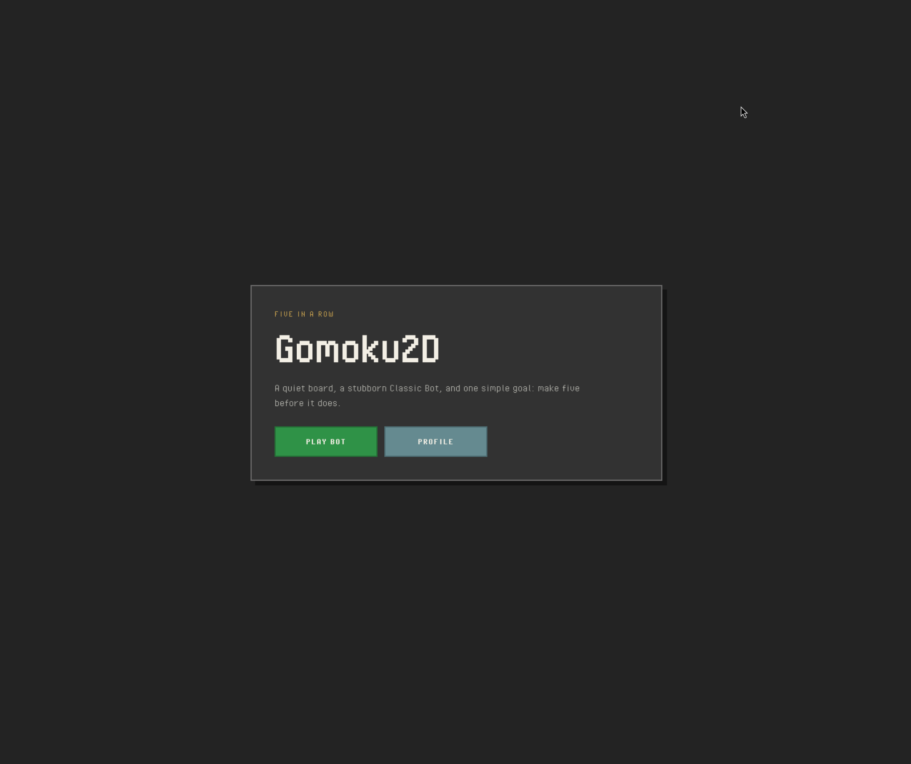
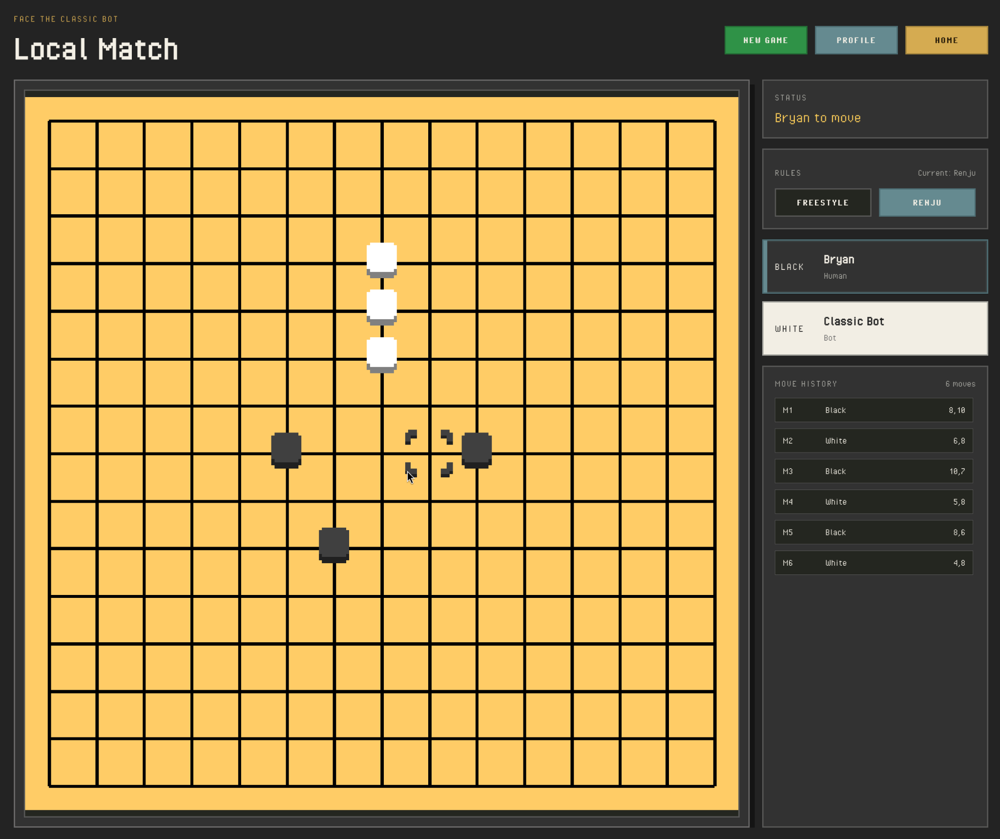
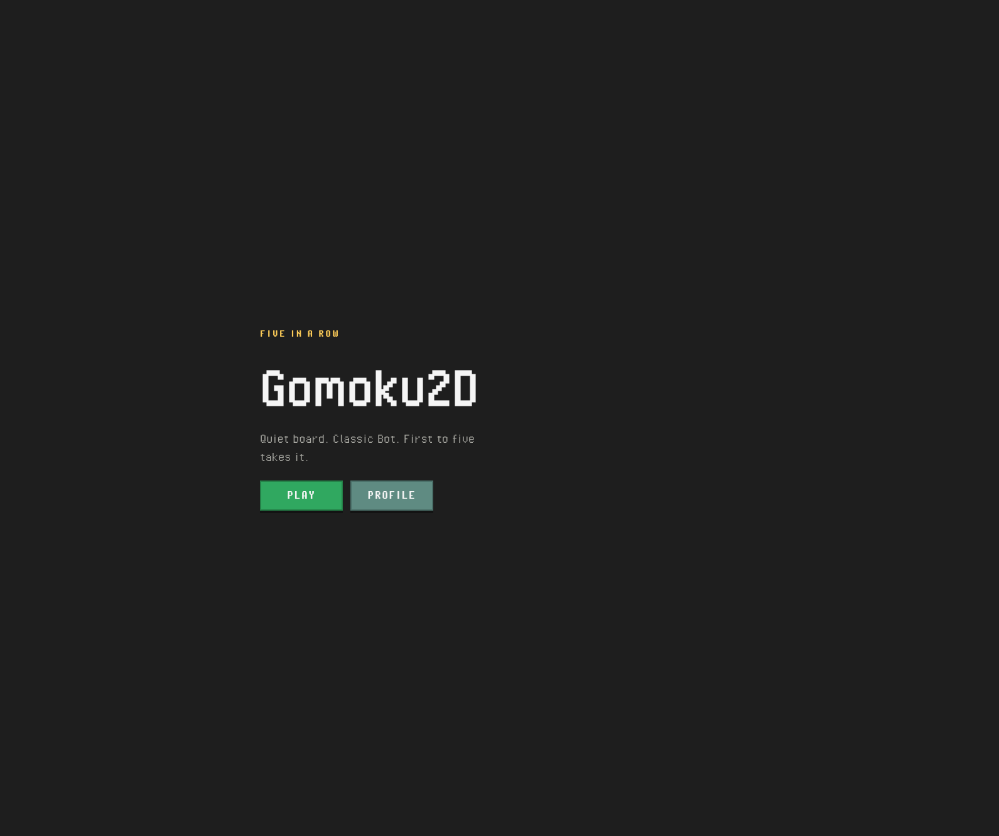
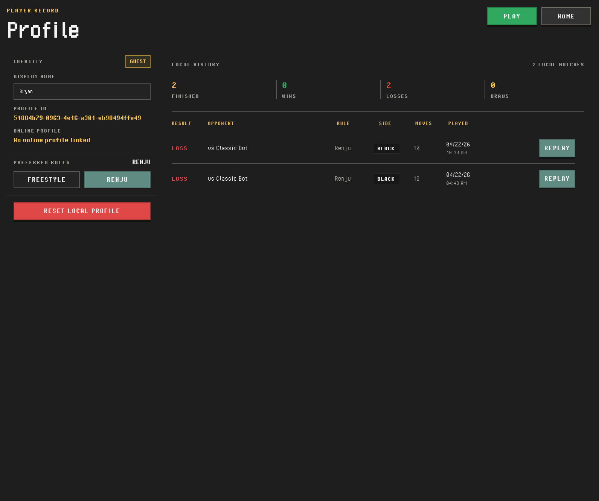

# Visual Review

This document is the screenshot-based companion to `visual_design.md`.

Use it when reviewing mocks, UI tweaks, or layout passes against the actual
evolution of the DOM shell. `visual_design.md` is the rulebook; this file is
the evidence and critique set.

## v0.1

### References

<table>
  <tr>
    <td width="50%">
      
       
      Game
    </td>
    <td width="50%">
      
       
      Settings
    </td>
  </tr>
</table>

### What v0.1 got right

- strong retro tone immediately
- clear board dominance
- chunky, high-contrast controls
- UI feels game-like before it feels app-like

### Where v0.1 broke down

- too much of the experience lived inside one game scene
- gameplay, settings, and shell concerns blurred together
- UI language was expressive, but not scalable

The lesson is not "go back to v0.1." The lesson is to preserve its punch
without rebuilding the whole app as one canvas-driven surface.

## v0.2.1

### References

<table>
  <tr>
    <td width="50%">
      
       
      Home
    </td>
    <td width="50%">
      
       
      Match
    </td>
  </tr>
  <tr>
    <td width="50%">
      
       
      Replay
    </td>
    <td width="50%">
      
       
      Profile
    </td>
  </tr>
</table>

### What v0.2.1 improved

- proper DOM-shell structure
- clearer screen separation between home, match, replay, and profile
- stronger foundation for local profile and replay features
- more scalable spacing, scrolling, and panel ownership

These references are useful because they show the shell under practical
density, not just idealized empty states.

### Where v0.2.1 still feels weak

- the shell can still feel too app-like or too muted
- some screens still carry more chrome than they need
- retro charm is less immediate than in v0.1
- hierarchy is better than before, but not fully confident under dense states

## v0.2.2

### References

<table>
  <tr>
    <td width="50%">
      
       
      Home
    </td>
    <td width="50%">
      
       
      Match
    </td>
  </tr>
  <tr>
    <td width="50%">
      
       
      Replay
    </td>
    <td width="50%">
      
       
      Profile
    </td>
  </tr>
</table>

### What v0.2.2 improved

- stronger palette contrast and clearer button roles
- flatter shell with fewer unnecessary boxes and panel frames
- clearer live-match and replay HUD language
- stronger record-screen treatment on profile

These references are useful as the current baseline for refinement work, not as
the end of the visual pass.

### Where v0.2.2 still needs work

- portrait/mobile layouts still feel like desktop screens collapsing downward
- the shell is still heavily text-driven in places where compact controls would
  help
- some controls and metadata blocks still depend on long labels rather than a
  denser visual language
- the mobile version likely needs screen-specific layouts, not just more
  breakpoint tuning

## Design takeaway

- keep v0.1's retro punch and board-first confidence
- keep v0.2.1's structure, separation, and scalability
- keep v0.2.2's flatter shell and clearer button-role language
- avoid reintroducing v0.1's scene-bound UI
- avoid letting the current shell stay too text-heavy to adapt cleanly to
  mobile
